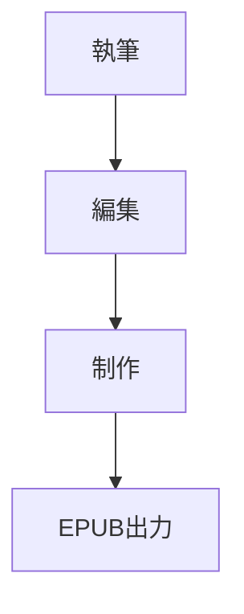

# 執筆・編集ツール市場調査レポート

> 2026-03-08 実施
> 目的: AozoraEpub3-dotnet の執筆モード・編集機能の設計に向けた競合・市場分析

---

## 1. 調査対象

### 日本市場（執筆特化）
- **Nola（ノラ）** — 日本で最も人気の小説執筆アプリ
- **NOVEWRITE** — 投稿サイト対応のWebエディタ
- **TATEditor** — 縦書き専用フリーエディタ（PDF/EPUB出力対応）

### 海外市場（執筆＋制作統合）
- **Scrivener** — 執筆の整理・管理に特化（$69.99、永久ライセンス）
- **Vellum** — フォーマッティング＋美しいテンプレート（$249.99、Mac専用）
- **Atticus** — 執筆＋フォーマッティング統合（$147、全OS対応）
- **Dabble** — クラウドベース執筆ツール（月額制）

### 漫画・同人誌向け
- **CLIP STUDIO PAINT** — 漫画制作からEPUB書き出しまで一貫対応
- **BOOK☆WALKER 電子コミック作成ツール** — 固定レイアウトEPUB作成（無料）
- **FixedEpub3JS** — Web上で漫画向けEPUBを作成

---

## 2. 競合の強み・弱みマトリクス

### 2-1. 執筆機能の比較

| 機能 | Nola | Scrivener | Atticus | NOVEWRITE | 我々(現状) | 我々(計画) |
|------|:----:|:---------:|:-------:|:---------:|:----------:|:----------:|
| テキスト入力 | ○ | ○ | ○ | ○ | ○ | ○ |
| 縦書きプレビュー | ○ | × | × | × | ○ | ○ |
| 話単位の管理 | ○ | ○ | ○ | ○ | × | ○ |
| プロット管理 | ○ | ○ | × | × | × | △メモ |
| キャラクター管理 | ○ | ○ | × | × | × | △メモ |
| 相関図 | ○ | × | × | × | × | × |
| 執筆目標・進捗 | × | ○ | ○ | × | × | ○ |
| ダークモード | △要望あり | ○ | ○ | × | ○ | ○ |
| ルビ入力支援 | × | × | × | ○ | ○ | ○ |
| 投稿サイト記法対応 | × | × | × | ○ | ○ | ○ |
| スマホ/PC同期 | ○ | △ | ○ | ○ | × | × |
| オフライン | ○ | ○ | ○ | × | ○ | ○ |

### 2-2. 編集・制作機能の比較

| 機能 | Vellum | Atticus | Scrivener | CLIP STUDIO | 我々(現状) | 我々(計画) |
|------|:------:|:-------:|:---------:|:-----------:|:----------:|:----------:|
| 書誌情報編集 | ○ | ○ | ○ | × | △設定のみ | ○ |
| 表紙画像設定 | ○ | ○ | ○ | ○ | △設定のみ | ○ |
| 目次自動生成 | ○ | ○ | ○ | × | ○自動 | ○ |
| 目次手動編集 | ○ | ○ | × | × | × | ○ |
| 章構成の並替え | ○ | ○ | ○ | × | × | ○ |
| 挿絵配置 | ○ | ○ | × | ○ | × | ○ |
| デザインテンプレート | ○(50+) | ○(20+) | × | × | × | ○ |
| CSSカスタマイズ | × | △ | × | × | △Phase C | ○ |
| デバイス別プレビュー | ○ | ○ | × | × | × | △検討 |
| EPUB出力 | ○ | ○ | ○ | ○ | ○ | ○ |
| PDF出力（印刷用） | ○ | ○ | ○ | ○ | × | ○ |
| 奥付自動生成 | ○ | ○ | × | × | × | ○ |
| 固定レイアウト(漫画) | × | × | × | ○ | × | ○ |
| 見開き管理 | × | × | × | ○ | × | ○ |
| コラボレーション | × | ○ | × | × | × | × |

---

## 3. 各競合の詳細分析

### 3-1. Nola（ノラ）— 日本の執筆ツールで圧倒的人気

**強み:**
- プロット作成（起承転結テンプレート）
- キャラクター管理（プロフィール、相関図）
- 話単位の原稿管理
- 縦書きプレビュー対応
- スマホ・PC同期（無料）
- 操作が直感的で初心者に優しい

**ユーザーの声（App Storeレビューより）:**
- 「浮かんだシーンを書いて後から並べ替えられるのが良い」
- 「プロットや資料を執筆中に引っ張り出しやすい」
- 「背景色が白だけでなくダークなものがあると目が疲れなくて助かる」（要望）
- 「話数が増えると毎回下へスクロールが大変。昇順・降順の切替がほしい」（要望）
- 「本文の文字の大きさ(太さ)変更がほしい」（要望）

**我々への示唆:**
- 話単位の管理は必須。カード型執筆モードの方向性は正しい
- ダークモード対応の要望は実際に多い（我々のプレビュー問題と同根）
- プロット・キャラ管理は人気だが、フリーカード（メモ）で代用可能

### 3-2. Scrivener — 大規模プロジェクトの組織化

**強み:**
- バインダー機能: 原稿を章・シーン・メモに分割してツリー管理
- コルクボード: シーンの要約をカードで可視化・並替え
- リサーチフォルダ: 参考資料（画像、PDF等）を作品と一緒に管理
- 分割画面: 2つのドキュメントを同時に表示・編集
- スナップショット: バージョン履歴で安心して改稿

**弱み:**
- EPUB/PDF出力（コンパイル機能）が複雑で「悪夢」と評される
- UIが複雑、学習コストが高い
- リアルタイムのEPUBプレビューなし

**我々への示唆:**
- 「書く→整理する→出力する」のうち、Scrivenerは「整理」が強く「出力」が弱い
- 我々は逆に「出力」（EPUB変換）が強み。「整理」を補完すれば差別化できる
- コンパイルの複雑さは反面教師。EPUB変換はワンクリックを目指す

### 3-3. Vellum — フォーマッティングの王者（Mac専用）

**強み:**
- 50以上のプロフェッショナルなデザインテンプレート
- 章ヘッダーデザイン、ドロップキャップ、装飾区切り線
- デバイス別プレビュー（Kindle、iPad、iPhone、Kobo）
- ドラッグ＆ドロップの簡単操作
- 即座にスタイル変更が反映される美しいUI

**弱み:**
- Mac専用（Windows非対応を公言）
- 執筆機能が弱い（フォーマッティング特化）
- 価格が高い（$249.99）
- コラボレーション機能なし

**我々への示唆:**
- Vellumの「テンプレートで美しい本が簡単にできる」体験は目標にすべき
- Windows対応は我々の大きなアドバンテージ
- デバイス別プレビューは検討に値する（WebView2でKindle風CSSを適用するなど）

### 3-4. Atticus — 「ScrivenerとVellumの子供」

**強み:**
- 執筆とフォーマッティングを1つのツールで統合
- 全OS対応（Windows、Mac、Linux、Chromebook）
- 章・シーン・パーツの管理（Scrivener的）
- プロフェッショナルなEPUB/PDF出力（Vellum的）
- コラボレーション機能（編集者やβリーダーとの共同作業）
- 執筆目標・タイマー機能

**弱み:**
- Vellumほどスムーズではない（Webベースのため）
- テンプレート数はVellumより少ない
- スマートクォートの処理に課題

**市場での評価:**
- 「VellumからAtticusに乗り換えた。書く場所とフォーマットが同じ場所にあるのが良い」
- 「8冊フォーマットしたがKDPで問題ゼロ」
- 「Vellumの90%の機能が40%安い価格で手に入る」

**我々への示唆:**
- Atticusが証明したこと: 執筆＋制作の統合ツールには強い需要がある
- 全OS対応は我々も同じ方向（Avalonia = クロスプラットフォーム）
- 我々の独自価値: 日本語特化（縦書き、ルビ、投稿サイト記法）+ 漫画対応

### 3-5. NOVEWRITE — 投稿サイト記法の相互変換

**強み:**
- なろう、カクヨム、pixiv、ハーメルン、アルファポリス等のルビ形式に対応
- 既存ルビの投稿サイト間変換が可能
- クイックメニューからルビ・記号の即座入力
- 字下げやスペースの自動補完

**我々への示唆:**
- 投稿サイトへのエクスポート機能は差別化ポイント
- 我々はEPUB出力に加え「なろう/カクヨム投稿用テキストエクスポート」を追加すべき
- ルビの相互変換は既にEditorConversionEngineの延長で実装可能

### 3-6. 漫画・同人誌市場

**現状の課題:**
- CLIP STUDIO PAINTはEPUB書き出し可能だが高価で大規模
- BOOK☆WALKERの電子コミック作成ツールはWeb限定
- FixedEpub3JSはWebベースで機能限定
- 個人漫画家は「画像をEPUBに変換するフリーソフト」に頼っている状態

**同人誌制作者の声:**
- 「画像をEPUB形式に変換するには変換ソフトが必要。フリーソフトは安全性確認が必要」
- 「CLIP STUDIO PAINTなら制作からEPUB書き出しまでノンストップで可能だが高い」
- 「電子書籍の表紙は小さく表示されるので、最初のインパクトが勝負」

**我々への示唆:**
- 個人漫画家向けの「画像→固定レイアウトEPUB」は明確なニーズがある
- 無料で使えるデスクトップツールは競合が少ない（ブルーオーシャン）
- 見開き管理、表紙設定、奥付自動生成が求められている

---

## 4. 我々の差別化ポイント（現状の強みと計画の独自性）

### 既にある強み
1. **青空文庫記法→EPUB変換の実績** — Java版から蓄積された変換品質
2. **縦書きリアルタイムプレビュー** — Nola、Atticus、Vellumにもない
3. **日本語記法のハイブリッド対応** — MD + 青空文庫 + なろう + カクヨム
4. **無料・オープンソース（GPL v3）** — Atticus $147、Vellum $249に対して無料
5. **クロスプラットフォーム（Avalonia）** — Vellumにできないこと

### 計画する独自性（どの競合もやっていないこと）
1. **日本語小説に特化した執筆→編集→制作→EPUB出力の統合パイプライン**
   - Nolaは執筆特化でEPUB出力なし
   - Atticusは英語圏向け（縦書き・ルビ未対応）
   - Vellumは制作特化で執筆機能が弱い
2. **投稿サイトエクスポート + EPUB出力の両立**
   - なろう/カクヨム形式でコピペ投稿 + 同じ原稿からEPUB生成
3. **漫画（固定レイアウト）と小説（リフロー）の両対応**
   - 同一ツールで文字本と画像本を制作できるツールは皆無
4. **ブックエディタ（編集さん機能）**
   - Scrivenerの整理力 + Vellumの出力品質を無料で

---

## 5. 潜在ニーズの発見（調査から見えたもの）

### 5-1. 確実に需要があるもの（複数ソースで確認）
| ニーズ | 裏付け |
|--------|--------|
| ダークモード | Nolaレビューで要望多数、我々も実際に問題発生 |
| 話単位の管理 | Nola/Scrivener/Atticusすべてが提供 |
| 投稿サイト記法変換 | NOVEWRITEの主要機能、ユーザー需要明確 |
| ワンクリックEPUB出力 | Scrivenerの「コンパイルが悪夢」への不満 |
| フォーマッティングテンプレート | Vellum/Atticusの差別化ポイント |
| 漫画→EPUB変換 | BOOK☆WALKER、CLIP STUDIOが対応、個人漫画家の需要 |

### 5-2. あると嬉しいが必須ではないもの（フリーカードで代用可）
| ニーズ | 判断理由 |
|--------|--------|
| プロット管理 | Nola特有の強み。専用UIは工数大、フリーカードで代用可能 |
| キャラクター管理 | 同上。構造化されたフォームは過剰 |
| 相関図 | Nola特有。我々のスコープ外 |
| コラボレーション | Atticus特有。ネットワーク機能は複雑すぎる |
| AI文章支援 | 2025年のトレンドだが、外部APIへの依存を避けたい |

### 5-3. 新たに発見した検討すべき機能
| 機能 | 根拠 | 優先度 |
|------|------|--------|
| 投稿サイトエクスポート | NOVEWRITEの主要機能。なろう/カクヨム記法テキスト出力 | 高 |
| PDF出力（同人誌入稿用） | 同人誌印刷は紙媒体需要が根強い。裁ち落とし対応 | 中 |
| 執筆目標・進捗トラッキング | Atticus/Scrivenerの人気機能。文字数目標+進捗バー | 中 |
| デバイス別プレビュー | Vellumの売り。Kindle/Kobo風CSSの切替で模擬可能 | 低 |
| 奥付テンプレート | 同人誌では必須。フォーム入力で自動生成 | 中 |
| バージョン管理（スナップショット） | Scrivenerの安心機能。改稿時に戻れる | 低 |

---

## 6. メニュー構成の再考

> ⚠ **VISION準拠で改訂（2026-03-08）**
> 旧提案ではWeb変換を「ツール」に格下げしていたが、VISION.mdにより
> URL→EPUB変換は「最大の差別化」「ユーザー獲得チャネル」と再定義されたため修正。

### 提案: VISION準拠のメニュー構成
```
📖 読む ──── URL→EPUB変換、ローカル変換（層1: 入口・差別化）
✏️ 書く ──── 執筆モード（層2）
📘 本にする ── ブックエディタ（層3）
⚙️ 設定
```

### 根拠
- 「読む」がトップ: このアプリの入口であり最大の差別化
- 3項目のみ: 初心者が「何をすればいいか」一目でわかる
- プレビュー・検証は各画面に内蔵（独立メニュー不要）
- 詳細は `feature-app-redesign-v2.md` セクション5を参照

## 7. ポジショニングマップ

```
                   執筆機能の充実度
                        ↑
                        │
         Scrivener ●    │    ● Nola
          (整理力)      │    (初心者向け)
                        │
   ────────────────────●┼──────────────────── 制作・出力の品質
                   Atticus│
                  (統合型) │
                        │
                        │    ● Vellum
                        │    (フォーマット特化)
                        │
                        ↓

    ★ 我々の目標ポジション: Atticusの位置を日本語特化で取る
      （執筆も制作も両方できて、縦書き・ルビ・投稿サイト対応）
```

---

## 8. 結論と次のアクション

### 我々が目指すべき姿
**「日本語の本を作るなら、これ一本で完結する」統合ツール**

Nolaの「書きやすさ」 + Vellumの「美しい出力」 + 漫画対応
を無料・オープンソースで提供する。

### 直近の優先実装（E7フェーズ）
1. **テーマ・フォントカスタマイズ** — ダークモード問題の根本解決
2. **チートシート＆テンプレート** — 初心者の敷居を下げる
3. **投稿サイトエクスポート** — 調査で発見した高需要機能

### 次フェーズ（E8以降）
4. **ブックエディタ** — 表紙、目次、挿絵、章構成の視覚的編集
5. **ガイド付き執筆（カードモード）** — 話単位の管理
6. **漫画対応（固定レイアウトEPUB）** — 個人漫画家の取込み
7. **PDF出力（同人誌入稿用）** — 紙媒体需要への対応


---

## 9. 追加検討事項（2026-03-08 議論より）

### 9-1. クラウドストレージ連携（Google Drive / OneDrive）

**背景:**
- 複数拠点にPCがあるユーザーはローカル保存だけでは不安
- バックアップの観点からもクラウド連携は重要
- 競合のNola、Atticus、Dabbleはクラウド同期を提供している

**実装アプローチの選択肢:**

| 方式 | メリット | デメリット |
|------|---------|----------|
| (a) API直接連携 | シームレスなUX、自動同期 | OAuth認証の実装が複雑、API変更リスク |
| (b) ローカル同期フォルダ対応 | 実装が簡単、ユーザーが既に持つ環境を活用 | 競合管理が必要、同期タイミング依存 |
| (c) プロジェクトの保存先選択 | 中間的アプローチ | 同期はユーザー任せ |

**推奨: (b)をベースに(a)を段階的に追加**

段階1（即対応可能）:
- プロジェクトの保存先をユーザーが自由に選べるようにする
- Google Drive / OneDrive / Dropboxのローカル同期フォルダを保存先に指定すれば自動的にクラウド同期される
- 「プロジェクトフォルダを開く」機能で同期フォルダへの誘導

段階2（将来）:
- Google Drive API / Microsoft Graph API による直接連携
- プロジェクト一覧のクラウド参照
- 競合検出と解決UI

**設定への追加:**
```
GuiSettings:
  DefaultProjectDirectory: string  // デフォルトの保存先
  RecentProjects: List<string>     // 最近のプロジェクトパス（クラウド上も含む）
```

### 9-2. Mermaid記法のサポート（MD拡張）

**背景:**
- Gemini、MS Copilot等のAIツールが構成図をMermaid記法で出力する
- 技術書・同人誌の技術系コンテンツではフローチャートやシーケンス図が必要
- Markdown拡張としてMermaidは事実上の標準（GitHub、GitLab、Notion対応）

**ユースケース:**
- 技術書の執筆時にアーキテクチャ図をテキストで記述
- AIが生成した構成図をそのままコピペして使用
- フローチャート、シーケンス図、ER図、ガントチャート等

**Mermaid記法の例:**
````

````

**実装アプローチ:**

| 方式 | メリット | デメリット |
|------|---------|----------|
| (a) WebView2でmermaid.js実行 | 本格的なレンダリング | プレビュー側のみ |
| (b) SVG変換してEPUBに埋込 | EPUB内で図が見える | 変換ライブラリが必要 |
| (c) 画像(PNG)変換してEPUB埋込 | 最も互換性が高い | 品質・サイズのトレードオフ |

**推奨: (a)+(c)の組み合わせ**

- プレビュー時: WebView2内でmermaid.jsを実行してリアルタイム表示
- EPUB出力時: mermaid記法をPNG画像に変換してEPUBに埋め込み
  （mermaid-cli または Puppeteer/Playwright経由でSVG→PNG変換）

**EditorConversionEngineへの追加:**
- ````mermaid` ブロックを検出
- プレビュー時: `<div class="mermaid">` タグに変換、mermaid.jsで描画
- EPUB出力時: 画像に変換して `` タグに置換

**変換パイプライン拡張:**
```
入力テキスト
    │
    ▼
[既存] ハイブリッド記法 → 青空文庫記法
    │
    ▼
[NEW] Mermaidブロック検出 → プレビュー用: mermaid.jsタグ
    │                     → EPUB用: PNG画像変換 + imgタグ
    ▼
AozoraEpub3Converter → XHTML
```

**対応する図の種類（優先度順）:**
1. フローチャート (graph/flowchart) — 最も使用頻度が高い
2. シーケンス図 (sequenceDiagram) — 技術書で多用
3. クラス図 (classDiagram) — 技術書向け
4. ガントチャート (gantt) — プロジェクト管理系
5. その他 — 状態遷移図、ER図等

**注意点:**
- mermaid.jsのバージョン管理（CDNまたはバンドル）
- EPUB出力時の画像品質（高DPI対応）
- 縦書きレイアウト内での図の配置（横書きブロックとして扱う）


### 9-3. 更新後の優先実装リスト

追加検討事項を含めた改訂版:

**直近（E7フェーズ）:**
1. テーマ・フォントカスタマイズ — ダークモード問題の根本解決
2. チートシート＆テンプレート — 初心者の敷居を下げる
3. 投稿サイトエクスポート — なろう/カクヨム形式テキスト出力
4. プロジェクト保存先の自由選択 — クラウド同期フォルダ対応（段階1）

**次フェーズ（E8: ブックエディタ）:**
5. 表紙、目次、挿絵、章構成の視覚的編集
6. 奥付テンプレート
7. PDF出力（同人誌入稿用）

**その後（E9+）:**
8. ガイド付き執筆（カードモード）
9. 漫画対応（固定レイアウトEPUB）
10. Mermaid記法サポート（技術書向け）
11. Google Drive / OneDrive API直接連携（段階2）
12. デバイス別プレビュー


---

## 10. AI API連携機能の検討

### 10-1. 日本市場の現状と背景

**日本ではAI利用の創作物に対して強い忌避感がある:**
- AI利用が判明して文学賞の受賞がキャンセルされた事例がある
- なろう/カクヨム等の投稿サイトでもAI生成作品への規制が強化傾向
- 「AI製」のレッテルは作品の価値を大きく毀損するリスクがある
- 同人誌即売会でもAI利用作品への議論が活発

**一方で、個人レベルでは既にAI活用が進んでいる:**
- VSCode + GitHub Copilot / Continue で技術書を書く人がいる
- ChatGPT / Gemini / Claude でプロット相談、アイデア出しをする人は多い
- 「AIに書かせる」ではなく「AIと相談しながら自分で書く」使い方が主流
- 校正・推敲の補助としてのAI利用は比較的受容されやすい

### 10-2. 設計方針: 「AI執筆」ではなく「AI支援ツール」

**原則: AIが書くのではなく、作者の執筆を支援する**

我々のアプリでAI機能を提供する場合、以下の立場を明確にする:
- AIは「文章を生成する」ためではなく「執筆を支援する」ために使う
- 最終的な文章は常に作者が書く/判断する
- AI利用は完全にオプトイン（デフォルトOFF、明示的に有効化）
- AI機能を使わなくてもアプリの全機能が使える

### 10-3. AI支援機能の候補（忌避感が低い順）

**Tier 1: ほぼ抵抗なく受け入れられるもの**

| 機能 | 説明 | AI側の役割 |
|------|------|-----------|
| 誤字脱字チェック | 変換ミス、送り仮名の誤り検出 | テキスト校正 |
| 表記ゆれ検出 | 「行なう」「行う」の混在を指摘 | パターン検出 |
| 文体統一チェック | 「です・ます」と「だ・である」の混在検出 | スタイル分析 |
| ルビ候補提示 | 漢字の読み方候補を提示 | 辞書検索+推定 |

**Tier 2: 「道具」として受け入れられるもの**

| 機能 | 説明 | AI側の役割 |
|------|------|-----------|
| 要約生成 | 書いた章のあらすじを自動生成（カード管理用） | テキスト要約 |
| 類語提案 | 「言った」の言い換え候補を表示 | 語彙支援 |
| 文章の読みやすさスコア | 一文の長さ、漢字率等の定量分析 | テキスト分析 |
| 設定矛盾チェック | 登場人物の名前や設定の矛盾を検出 | 整合性チェック |

**Tier 3: 慎重に提供すべきもの（議論の余地あり）**

| 機能 | 説明 | リスク |
|------|------|--------|
| プロット相談 | 「この展開の後どうしたら良い？」に対する提案 | 「AIが考えた」と批判されうる |
| 続きの提案 | 次の文の候補を複数提示 | 「AI生成」と見なされるリスク |
| 台詞生成 | キャラクターの台詞の候補提示 | 最も忌避感が強い |

### 10-4. 技術的アーキテクチャ

**APIキーはユーザー自身が持ち込む（BYO-Key方式）:**
- アプリ側でAPIキーを提供しない（コスト・利用規約の問題を回避）
- ユーザーが自分のAPIキーを設定画面で登録
- 対応API: OpenAI、Anthropic Claude、Google Gemini、ローカルLLM(Ollama等)
- APIキーは暗号化してローカル保存（クラウドには送信しない）

**プラグイン的なアーキテクチャ:**

```
┌─────────────────────────────────────────────────┐
│ エディタ（執筆モード）                            │
│                                                 │
│  [テキスト入力]                                  │
│       │                                         │
│       ├─ (既存) 変換エンジン → プレビュー          │
│       │                                         │
│       └─ (NEW) AI支援パネル ← オプトイン          │
│           │                                     │
│           ├─ 校正チェック  ← Tier 1              │
│           ├─ 表記ゆれ検出  ← Tier 1              │
│           ├─ 類語提案      ← Tier 2              │
│           └─ 要約生成      ← Tier 2              │
│                                                 │
└────────┬────────────────────────────────────────┘
         │ (ユーザーのAPIキーで通信)
         ▼
┌─────────────────────────────────────────────────┐
│ AI Provider Adapter (抽象化レイヤー)              │
│                                                 │
│  ┌──────────┐ ┌──────────┐ ┌──────────┐        │
│  │ OpenAI   │ │ Claude   │ │ Gemini   │ ...    │
│  │ Adapter  │ │ Adapter  │ │ Adapter  │        │
│  └──────────┘ └──────────┘ └──────────┘        │
│                                                 │
│  ┌──────────┐                                   │
│  │ Ollama   │ ← ローカルLLM（ネット不要）         │
│  │ Adapter  │                                   │
│  └──────────┘                                   │
└─────────────────────────────────────────────────┘
```

**ローカルLLM（Ollama）対応は差別化ポイント:**
- ネット環境不要で動作
- データがローカルから出ない（プライバシー完全保護）
- 「AIを使っているがデータは外に出ていない」と説明できる
- 技術系ユーザー（VSCodeでOllamaを使う層）との親和性が高い

### 10-5. UI設計の方針

**「AI機能は目立たせない」デザイン:**
- デフォルトではAI関連のUIを一切表示しない
- 設定画面の「AI支援（実験的機能）」で有効化
- 有効化しても控えめなアイコン（サイドパネルの小さなタブ）
- 「AIが書いた」ではなく「AIが指摘した」というフレーミング

**校正結果の表示:**
```
┌─────────────────────────────────────────┐
│ AI校正結果                [非表示] [再実行] │
├─────────────────────────────────────────┤
│ ⚠ 3行目: 表記ゆれ「行なう」→「行う」?     │
│ ⚠ 7行目: 一文が長すぎます（120文字）      │
│ ⚠ 12行目: 「彼女は彼女の」重複表現?       │
│ ✓ 誤字脱字: 検出なし                     │
│                                         │
│ 📊 読みやすさスコア: 72/100              │
│    漢字率: 32% | 平均文長: 45文字         │
└─────────────────────────────────────────┘
```

### 10-6. 既存ツールとの比較（AI支援の観点）

| ツール | AI機能 | 方式 |
|--------|--------|------|
| VSCode + Copilot | コード補完、文章続き提案 | クラウドAPI(GitHub) |
| VSCode + Continue | ローカルLLM対応の補完 | Ollama等 |
| Nola | なし | — |
| Atticus | なし（ProWritingAid連携あり） | 外部ツール |
| Scrivener | なし | — |
| Grammarly | 文法チェック、文体改善 | クラウドAPI(独自) |
| 一太郎 | ATOK連携で校正 | ローカル辞書 |
| **我々（計画）** | **校正/表記ゆれ/類語 (BYO-Key + Ollama)** | **選択式** |

**我々の独自ポジション:**
- VSCodeのAI体験を「小説執筆に特化」して提供
- Ollamaサポートでプライバシー重視層を取り込む
- 日本語小説に特化したプロンプト（文体チェック、ルビ候補等）
- 「AI生成」ではなく「AI校正」に徹することで忌避感を最小化

### 10-7. 実装の優先度

```
Phase 1 (ローカルのみ、AI不要):
  - 読みやすさスコア（漢字率、平均文長等の定量分析）
  - 表記ゆれ検出（辞書ベース、正規表現）
  - 重複表現検出（パターンマッチ）
  → AIなしでも価値がある校正機能を先に提供

Phase 2 (AI校正 — Tier 1):
  - 誤字脱字チェック（AI利用）
  - 文体統一チェック
  - ルビ候補提示
  → 「校正ツール」としてのAI利用（最も受容されやすい）

Phase 3 (AI支援 — Tier 2):
  - 類語提案
  - 要約生成（カード管理用）
  - 設定矛盾チェック
  → 「執筆支援ツール」としてのAI利用

Phase 4 (将来検討 — Tier 3):
  - プロット相談
  - 社会情勢を見て判断（AI創作への忌避感が緩和されるか）
```

### 10-8. 注意事項・倫理的配慮

- **明示的な同意**: AI機能の有効化時に「この機能はAI APIを使用します」と明示
- **データの取り扱い**: 「あなたの原稿はAPIプロバイダーに送信されます」の注意表示
- **Ollama推奨**: プライバシーを重視するユーザーにはOllamaを推奨
- **「AI使用」の非表示**: EPUB出力物にAI使用のメタデータは埋め込まない
  （使用の開示は作者の判断に委ねる）
- **ライセンス**: AI機能部分はプラグインとして分離し、
  本体のGPL v3ライセンスとの整合性を確保

### 10-9. 更新後の全体優先リスト（最終版）

**直近（E7: 既存機能の改善）:**
1. テーマ・フォントカスタマイズ
2. チートシート＆テンプレート
3. 投稿サイトエクスポート
4. プロジェクト保存先の自由選択（クラウド同期フォルダ対応）

**次フェーズ（E8: ブックエディタ）:**
5. 表紙、目次、挿絵、章構成の視覚的編集
6. 奥付テンプレート
7. PDF出力（同人誌入稿用）

**中期（E9: 執筆モード拡張）:**
8. ガイド付き執筆（カードモード）
9. ローカル校正機能（AI不要: 読みやすさスコア、表記ゆれ、重複検出）
10. 漫画対応（固定レイアウトEPUB）

**後期（E10: 高度な機能）:**
11. AI校正支援（BYO-Key + Ollama）— Tier 1: 誤字脱字、文体チェック
12. Mermaid記法サポート
13. AI執筆支援 — Tier 2: 類語提案、要約生成
14. Google Drive / OneDrive API直接連携
15. デバイス別プレビュー
